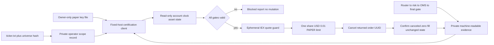

# Alpaca PAPER connectivity certification

## Scope and boundary

`aegis-alpaca-paper` is an offline/operator utility for a bounded connection to
an Alpaca paper account. HTTPS remains outside the colocated hot path. The
utility has no live hostname, no live mode, no generic URL option, no model
input, and no account-reset or bulk-cancel operation.

Its `certify` command performs connectivity certification only. Its stricter
`certify-system-path` command consumes a fixed evidence record produced by the
repository router, deterministic risk engine, event-sourced OMS, and final
`PaperBrokerGateway` safety gate. See the
[system-path boundary](alpaca-paper-system-path.md).

The utility implements only currently documented public endpoints:

| Operation | Method and path | Purpose |
| --- | --- | --- |
| Account | `GET paper-api.alpaca.markets/v2/account` | active/block state |
| Clock | `GET paper-api.alpaca.markets/v2/clock` | regular-session gate |
| Asset | `GET paper-api.alpaca.markets/v2/assets/{symbol}` | US-equity eligibility |
| Open orders | `GET paper-api.alpaca.markets/v2/orders` | preservation snapshot |
| Positions | `GET paper-api.alpaca.markets/v2/positions` | preservation snapshot |
| Latest IEX quote | `GET data.alpaca.markets/v2/stocks/{symbol}/quotes/latest` | nonmarketability guard only |
| Create | `POST paper-api.alpaca.markets/v2/orders` | one bounded paper order |
| Resolve | `GET paper-api.alpaca.markets/v2/orders:by_client_order_id` | ambiguous-POST recovery |
| Inspect/cancel | `GET` or `DELETE paper-api.alpaca.markets/v2/orders/{id}` | targeted cancellation |

Specifications are the official Alpaca
[authentication](https://docs.alpaca.markets/us/v1.1/docs/authentication-1),
[paper trading](https://docs.alpaca.markets/us/v1.4.2/docs/paper-trading),
[order creation](https://docs.alpaca.markets/us/reference/postorder),
[order cancellation](https://docs.alpaca.markets/us/reference/deleteorderbyorderid-1),
[client-order lookup](https://docs.alpaca.markets/us/reference/getorderbyclientorderid),
[account](https://docs.alpaca.markets/us/docs/working-with-account),
[asset](https://docs.alpaca.markets/us/reference/get-v2-assets-symbol_or_asset_id),
[position](https://docs.alpaca.markets/us/reference/getallopenpositions), and
[IEX quote](https://docs.alpaca.markets/us/reference/stocklatestquotesingle-1)
documentation. Provider behavior must be revalidated when these specifications
change.

## Flow

No quote value, account identifier, buying power, position, order identifier,
credential, or provider response body is written to a successful report.
Account, existing-order, position, and client-order references are one-way
hashes over bounded projections where evidence needs continuity.

## Failure and recovery

Network, malformed response, blocked account, closed market, wrong session,
ineligible asset, unsafe quote, changed authorization, and state mismatch fail
closed. A create timeout is never retried. The deterministic client ID is
queried once to discover whether the first request created an order. An
unresolved outcome is `ORDER_AMBIGUOUS` and requires manual portal inspection.

The utility has no automated fill recovery because selling could alter a
pre-existing position or become a short sale under a race. An unexpected fill
therefore stops certification and invokes the reconciliation runbook.

## Evidence interpretation

A passed report proves only that the credential was accepted, the chosen asset
and clock gates passed, Alpaca acknowledged and canceled the bounded paper
order, and observed account state remained unchanged. Alpaca documents that
paper trading is a simulation and differs from live execution, including fill
and liquidity assumptions. This result proves neither economic performance nor
real-venue behavior.

The connectivity-only command fixes `system_order_path_certified` to `false`.
The system-path command may set it true only when the exact C++ evidence and
broker request both pass. All reports fix
`broker_response_roundtrip_certified` to `false`: Alpaca responses are not yet
applied back through the deterministic OMS.
