# Alpaca PAPER deterministic outbound system path

## Supported claim

The bounded certification path connects an exact deterministic outbound command
to Alpaca's paper endpoint without enabling live trading:

```mermaid
flowchart LR
    U[ticker.txt symbol] --> R[Deterministic router]
    R --> K[Local pre-trade risk and journal]
    K --> O[Event-sourced OMS command]
    O --> G[Final PaperBrokerGateway safety gate]
    G --> E[Versioned evidence plus stable hash]
    E --> V[Off-hot-path validator]
    V --> H[Fixed Alpaca PAPER HTTPS client]
    H --> C[Targeted cancel and state-preservation check]
```

The C++ path is preallocated and deterministic. Network I/O, TLS, polling, and
provider parsing occur only in the operator process after the outbound evidence
passes independent validation. The HTTPS client recognizes only the fixed paper
and market-data hosts and offers no live endpoint option.

## Evidence binding

`AlpacaPaperPathEvidence` includes the schema/build identity, exact safe order
terms, a namespaced symbol-derived certification `InstrumentId`, router
request/decision hashes, risk snapshot/context/decision hashes,
risk and OMS journal sequences, OMS command hash, final gateway configuration,
request and audit hashes, outbound sequence, and explicit PAPER safety flags.
The C++ producer and Python consumer independently calculate the same stable
FNV-1a hash over a documented fixed-width layout. The external report records
SHA-256 identities for the complete C++/schema source tree, executable, and
evidence object. The private authorization binds the source-tree hash; any C++,
CMake, generated-contract, or IDL edit invalidates it before transmission.

The certification `InstrumentId` is the first 128 bits of SHA-256 over the
ASCII namespace `AEGIS-ALPACA-PAPER-INSTRUMENT-V1:` followed by the exact
symbol. It prevents a symbol substitution across the deterministic components.
It is not authoritative exchange reference data and must not be reused as an
Alpaca asset ID or point-in-time instrument master.

The broker request is fixed to:

- a symbol from `ticker.txt`;
- buy one share;
- simple limit order at USD 0.01;
- `day` time in force;
- `extended_hours=false`; and
- the exact OMS-generated `client_order_id`.

Any mismatch blocks before transmission. Order submission is never retried; an
ambiguous result is resolved by the client order ID or escalated.

## Unsupported boundary

The current path does not feed broker acknowledgements, rejects, cancel events,
or fills back into the deterministic OMS. It has no websocket session, durable
network outbox/inbox, Alpaca-specific response sequencer, or drop-copy feed.
Consequently, a pass certifies the deterministic outbound command and bounded
paper transport only. It is not evidence of complete OMS recovery or continuous
broker operation.

No historical market data is persisted by this path. The IEX quote is ephemeral
and used only to prove that the one-cent limit is deeply nonmarketable.
