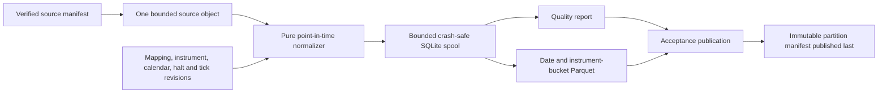

# Canonical minute normalization and persistent point-in-time storage

## Safety boundary

This subsystem is offline research infrastructure. It cannot generate a
forecast, order intent, risk approval, or gateway command. It neither downloads
data nor creates daily vendor bars.

The accepted canonical dataset starts only at an immutable partition manifest.
Raw source objects, the normalization spool, quality reports, and orphaned
Parquet files are not accepted datasets by themselves.

## Audited inputs

The Prompt 56 preflight decoded and integrity-checked every data-repository
manifest present on 2026-09-11:

- 1,851 source manifests, 981,823,303 declared source bytes, and 9,790,635
  declared source records;
- 1,456 Alpaca IEX historical-bars response objects and 395 deterministic
  synthetic minute JSONL objects;
- 36,932 legacy JSONL partition manifests containing 9,576,817 rows; and
- 38,783 total manifest/object pairs, 7,724,928,068 verified bytes, with no
  missing object, size mismatch, hash mismatch, or malformed manifest.

Legacy per-symbol JSONL remains immutable input evidence. It is not silently
promoted to the new Parquet contract.

## Flow and bounds



| Bound | Default |
| --- | ---: |
| Source object parser | 64,000,000 bytes |
| Spool records | 20,000,000 |
| Spool file | 12,000,000,000 bytes |
| Instrument buckets | 8 |
| Parquet/SQLite fetch batch | 65,536 rows |
| Estimated output admission | 512 bytes per row plus 1 MB |

An individual source object is parsed only after its manifest size and SHA-256
match. Alpaca JSON requires a bounded whole-object parse because its response
wraps symbol arrays in one JSON object; this does not load the complete dataset.
Synthetic JSONL is parsed record by record. The spool and Parquet writer process
the overall corpus in fixed batches.

## Canonical record

The logical schema is
[`canonical-minute-record-v1.schema.json`](../../schemas/canonical-minute-record-v1.schema.json).
The record separates:

- exchange minute start and end;
- source publication and source availability;
- local receipt and local processing;
- integer OHLC and optional VWAP ticks;
- integer share volume and optional trade count;
- exact currency nanos per tick and the tick revision ID;
- stable instrument, original ticker, market, session, mapping, instrument
  revision, corporate-action, source-object, source-record, and source-manifest
  provenance; and
- per-record quality state, reason codes, schema version, and SHA-256.

Decimal provider prices first convert exactly to currency nanos and then divide
exactly by the point-in-time tick value. Fractional currency nanos, fractional
ticks, nonpositive prices, invalid OHLC ordering, negative quantities, timestamp
disorder, a known halt, and an out-of-session bar reject the input.

An observed zero volume is retained. No code path manufactures such a record.

## Duplicate and gap behavior

The economic key is `(InstrumentId, minute_start_exchange_time_ns)`. Two records
with identical economic hashes are idempotent. Differing OHLC, volume, trade
count, VWAP, market, or tick units for the same key are a conflict and abort the
complete source-object transaction.

Expected regular-session minutes are calculated from the retained session
bounds for each instrument. Missing minutes remain absent and make the quality
report `DEGRADED`; no forward fill or synthetic placeholder is permitted.

## Publication protocol

1. Acquire the repository admission fence using authoritative quota evidence
   and a conservative output/temporary projection.
2. Stage and fsync the quality report and Parquet file under `tmp/`.
3. Verify the Parquet row count and that every column codec is `ZSTD`.
4. Publish the immutable quality report.
5. Publish the immutable Parquet object.
6. Publish the generic partition manifest last. Its partition key binds the
   quality-report SHA-256.

Crashes before step 6 do not create an accepted partition. Re-execution is
idempotent for identical bytes and never replaces conflicting immutable data.

## Persistent point-in-time query parity

`PersistentPointInTimeStore` preserves `PointInTimeStore` operations:
`record_by_id`, `records_for`, `as_known_at`,
`latest_available_before`, `revisions_after`, `membership_at`,
`symbol_mapping_at`, and `corporate_action_history`.

It validates contiguous versions and exact correction/amendment parents before
an atomic append. `PRAGMA quick_check`, an application ID, schema metadata, and
per-record hashes detect incompatible or corrupted files. Queries use the same
inclusive/strict cutoff and deterministic sort semantics as the reference
implementation.

## Real-data reference semantics

The retained Prompt 52 snapshot remains intentionally current-only and is not
backdated. Real-data promotion follows
[ADR 0060](../adr/0060-now-known-reference-evidence-for-the-bounded-poc.md):
the mapping is a now-known/current-cohort observation available at the actual
bulk acquisition time, and every resulting record carries degraded mapping and
halt-history reason codes.

Prices use an exact one-nanodollar offline research quantum. This preserves the
provider decimal value as an integer but is explicitly not a venue minimum
tick and is forbidden from execution-facing use. A bounded standard Alpaca
corporate-actions response is retained as an immutable source object.
Structural-action identifiers accumulate from their effective dates, causing
labels that cross them to be invalidated. Original provider publication times
are unavailable and remain null rather than being inferred.

## Related contracts

- [Engineering contract](engineering-contract.md)
- [Point-in-time data contract](point-in-time-data-contract.md)
- [POC data repository](poc-data-repository.md)
- [Forecasting POC contract](forecasting-poc-contract.md)
- [ADR 0058](../adr/0058-sqlite-spool-and-parquet-minute-partitions.md)
- [ADR 0060](../adr/0060-now-known-reference-evidence-for-the-bounded-poc.md)
- [Recovery runbook](../operations/canonical-minute-recovery.md)
- [Real-data promotion runbook](../operations/real-minute-promotion.md)

## Reproducible commands

Use the required environment:

```bash
export AEGIS_PYTHON_ENV=/scratch/djy8hg/env/aegis_mx_contracts
"$AEGIS_PYTHON_ENV/bin/pytest" --no-cov \
  python/tests/test_canonical_minute.py python/tests/test_point_in_time.py
"$AEGIS_PYTHON_ENV/bin/ruff" check \
  python/research/aegis_mx_research/canonical_minute.py \
  python/research/aegis_mx_research/store.py \
  python/tests/test_canonical_minute.py python/tests/test_point_in_time.py
"$AEGIS_PYTHON_ENV/bin/mypy" \
  python/research/aegis_mx_research/canonical_minute.py \
  python/research/aegis_mx_research/store.py \
  python/tests/test_canonical_minute.py python/tests/test_point_in_time.py
make benchmark-canonical-minute
make schemas-check
make docs-check
```
