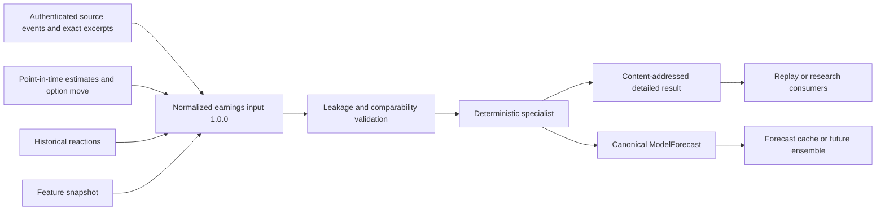
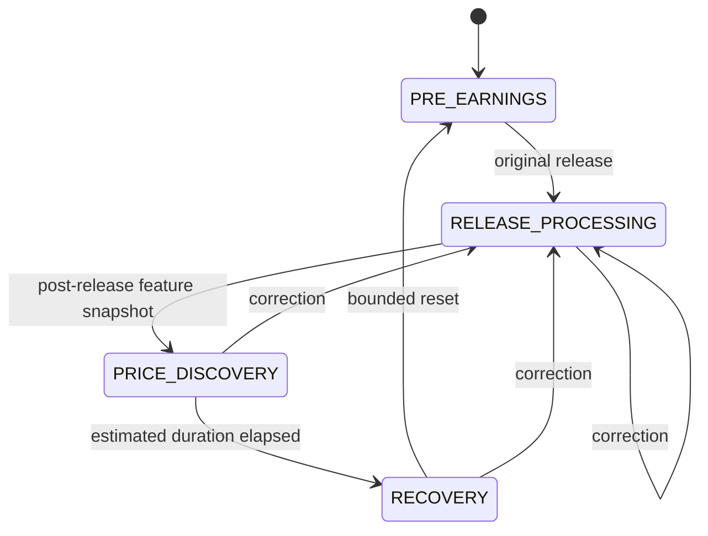

# Earnings-event specialist

The earnings specialist is a deterministic near-real-time Python component
outside the execution hot path. It consumes normalized, already-sanitized facts
and publishes an advisory `ModelForecast`; it cannot create an order.



## Normalized input schema

All numeric values are integers with explicit units. A metric comparison key is
the tuple `(kind, accounting basis, unit, fiscal period, segment)`. GAAP and
non-GAAP EPS, differing currencies/scales, different periods, and consolidated
versus segment metrics are therefore incompatible by construction.

The schema covers EPS, revenue, gross/operating/net margins, net income, free
cash flow, capex, segment revenue, and segment operating income. It carries:

- actual and prior reported values;
- analyst consensus, dispersion, range, count, and availability time;
- current and prior guidance ranges;
- one-time adjustments;
- option-implied absolute move;
- historical gap, volatility, and price-discovery duration;
- feature snapshot identity and pre/post-release market observations;
- source event identity, provider/document identity, raw/sanitized hashes,
  publication/receipt timestamps, and exact excerpts; and
- correction revision and prior normalized-input digest.

The canonical input is sorted compact JSON under schema `1.0.0`. SHA-256 binds
all fields. This format is an off-path retained intelligence artifact, not a
replacement for canonical FlatBuffers used across safety-critical boundaries.

## Point-in-time and correction rules

Exactly one official release source is required. Every source and feature must
have been available by the evaluation cutoff. Consensus and option inputs, plus
their supporting source receipts, must be no later than the official release.
Historical events must predate it. Any violation rejects the entire bundle.

A first release has revision one and no parent digest. A correction has a higher
revision and the nonzero SHA-256 of the prior normalized input. Corrections
produce new input/result/forecast identities and never overwrite prior output.

## Calculations

Standardized surprise uses the requested formula in integer PPM:

```text
surprise_ppm_j = (actual_j - consensus_j) * 1,000,000
                 / max(dispersion_j, epsilon_for_unit)
```

Division truncates toward zero. Missing consensus produces no numeric surprise.
A same-family estimate with a different basis or unit produces
`INCOMPATIBLE_METRIC` rather than a comparison.

Guidance change is the signed midpoint delta and its PPM ratio to the compatible
prior midpoint. Accounting-quality flags cover large GAAP/non-GAAP divergence,
material one-time adjustments, segment-to-consolidated mismatch, missing free
cash flow, and corrected releases. They are deterministic diagnostics, not
fraud allegations.

Materiality, direction, volatility, gap range, and price-discovery duration are
bounded fixed-point infrastructure rules using surprise, guidance, prior values,
pre-release option data, historical observations, and, when present,
post-release features. Missing inputs increase uncertainty and add explicit
reason codes. The resulting common forecast uses the source feature snapshot,
input-derived forecast ID, model/config versions, monotonic lifetime, return
quantiles, direction probabilities summing to 1,000,000 PPM, volatility, and a
zero calibration score.

## Lifecycle hooks

`EarningsEventLifecycle` exposes four states:



Hooks approve proposed phase notifications without blocking, tools, RPCs, or
order methods. Stale revisions, mismatched events, invalid phases, hook rejection,
and capacity exhaustion fail explicitly.

See [ADR 0016](../adr/0016-content-addressed-earnings-specialist.md), the
[failure runbook](../operations/earnings-specialist-failure-runbook.md), and the
[testing guide](../testing/earnings-specialist-testing.md).
