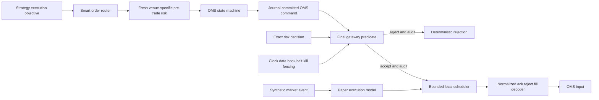

# Exchange gateway framework

## Scope

`aegis::execution` is a provider-neutral final command boundary with two local
implementations:

- `SyntheticExchangeGateway` operates in `SIMULATION` against repository-owned
  synthetic market events.
- `PaperBrokerGateway` operates in `PAPER` as an isolated in-process broker
  model. It does not contact a broker paper environment.

Neither implementation owns a socket, endpoint, real route, credential, proprietary
encoder, or venue dictionary. Native and FIX-compatible APIs are opaque adapter
boundaries only. See [ADR 0025](../adr/0025-default-off-synthetic-paper-gateway.md)
and the [licensed integration boundaries](licensed-integration-boundaries.md).

The deterministic [smart order router](smart-order-router.md) produces only a
proposed paper/synthetic child. It cannot call this gateway. Each child requires
a fresh venue-specific risk approval and normal OMS transition before reaching
the command flow below; see
[ADR 0026](../adr/0026-risk-separated-fixed-point-smart-order-routing.md).

## Command flow

The gateway validates the normalized command and exact risk-decision hash again;
it does not accept an order intent or model forecast. Every decision reserves
bounded audit capacity before mutating state. The journal record, normalized
event, and metrics snapshot always carry `SIMULATION` or `PAPER` mode.

## Session and sequencing

`SessionLifecycle` uses explicit `STOPPED`, `STARTING`, `LOGGING_ON`, `ACTIVE`,
`RECOVERING`, `LOGGING_OFF`, and `HALTED` states. Logon and logoff are local
abstractions, not a venue handshake. `SequenceManager` maintains independent
outbound and expected inbound sequences. Duplicate responses are suppressed;
gaps and out-of-order responses halt the session and are not returned as healthy
OMS inputs.

Synthetic response injection accepts only the configured session, account,
venue, configuration, authority epoch/fence, and instrument scope. Synthetic
market events with any quality other than `VALID` are audit-observed but cannot
change paper state or create a fill.

Heartbeats use injected monotonic time. Timeout enters `HALTED`/recovering and
requires an explicit recovery snapshot. Recovery never supplies live authority,
and an `UNKNOWN_RECOVERY` order keeps readiness false. The recovery checksum
binds every order field and slot; accepted snapshots are rebuilt into canonical
lookup positions before the session can become ready.

## Paper execution assumptions

All arithmetic uses integer ticks, integer units, and currency nanos. For one
synthetic market event, the model processes the first canonically stored
eligible order, making runtime bounded and replay deterministic. Queue ahead is
initialized from configured units plus matching displayed synthetic depth and
is depleted before a fill. Fill quantity is capped by remaining quantity and a
fixed partial-fill chunk.

Fees are quantity times configured currency nanos per unit. Slippage and impact
are configured integer ticks, with impact rounded upward from a fixed
ticks-per-million-units coefficient. A limit fill is clamped to its limit.
Pending cancels can race with a market event until their configured latency
expires. Halts suppress fills. Auction imbalance events can supply paired local
liquidity only while the synthetic instrument is in auction state.

These are explicit fictional assumptions. They do not represent actual venue
priority, hidden liquidity, dealer behavior, broker fees, market impact, or
economic performance.

## Concurrency and resource ownership

One owner thread mutates a gateway. A bounded atomic gate rejects concurrent
writers after 32 attempts. Commands, orders, scheduled events, rate windows,
market mappings, and audit records are preallocated. Capacity exhaustion is
explicit and inhibits operation where audit or integrity would be lost.

Metrics are fixed-cardinality values. `mode`, health, session state, build
identity, configuration hash, readiness, audit state, command/reject/fill counts,
rate-limit outcomes, sequence gaps, recovery count, and event high-watermark are
available without a telemetry exporter on the hot path.

## Build boundary

`AEGIS_ENABLE_LIVE_TRADING` defaults to `OFF`. With it off, live state and the
live transmission adapter type are not compiled. With it on, only the abstract
adapter boundary and build provenance exist; startup configuration still accepts
only simulation or paper, and there is no transmitter or activation mechanism.
