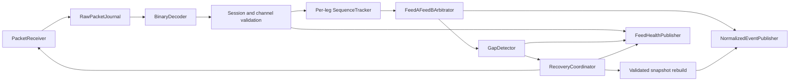
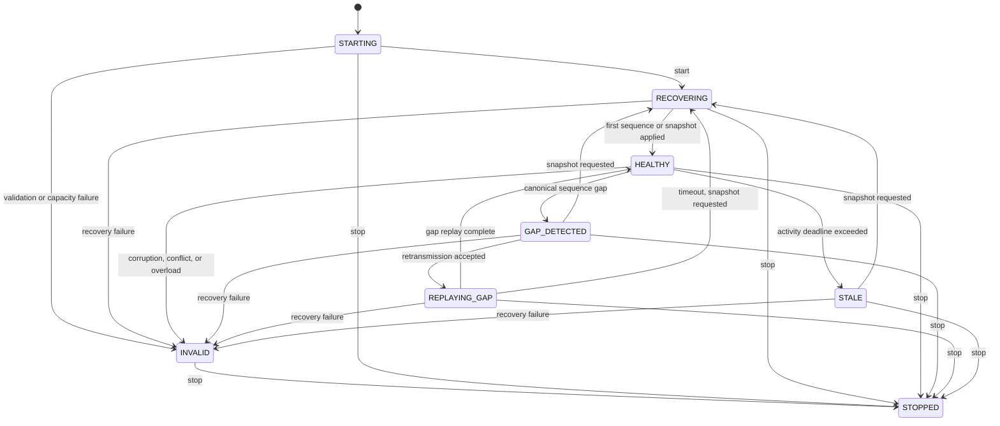

# Feed-handler framework

The feed handler is the license-clean ingress boundary between raw SMX/1 packets
and normalized synthetic market events. It implements continuity and recovery; it
does not implement a venue feed, strategy, risk decision, OMS, or gateway.

## Processing path

Every interface is nonblocking. The receiver, arbitration window, raw-journal
handoff, normalized-event handoff, health handoff, retransmission queue, history,
and snapshot image are bounded. Implementations return explicit `full`, `empty`,
`unavailable`, or `stopped` results instead of waiting.

## State and data quality

`HEALTHY` is the only state that emits `VALID` quality. Replayed missing events
are emitted as `DEGRADED`. Events received beyond a gap remain buffered; after the
missing range is validated, they become continuous and may be emitted as `VALID`.
`STALE` emits `STALE`, and any fail-closed error emits `INVALID`. Missing,
malformed, duplicate, out-of-order, overrun, and publisher-drop counters are
cumulative, so recovery never hides the incident.

Per-leg continuity is observed independently. A missing A packet is reported as
degraded redundancy when B supplies the canonical sequence. Canonical recovery is
started only when neither leg has supplied the next expected sequence.

## Sequence and recovery rules

- Sequence zero is invalid. A configurable inclusive maximum supports deterministic
  wrap tests; production SMX/1 uses the full nonzero `uint64_t` range.
- The arbitrator retains a bounded recent fingerprint window. A repeated matching
  packet is a duplicate; a repeated sequence with a different event hash is a
  conflict and invalidates the channel.
- A future sequence outside the arbitration window is an overload/configuration
  failure, not a silently truncated gap.
- Retransmission is attempted once per active gap. A rejected request or an injected
  monotonic deadline expiry requests a snapshot.
- A snapshot must match session, numeric venue/channel identity, contain a valid
  bounded book image, and match its stable book hash. The normalized publisher must
  accept the image before the arbitrator resets to `last_sequence + 1`.

## Backpressure

Raw packets are journaled before decode. If journaling cannot accept a packet, the
packet is not decoded and the channel becomes `INVALID`. Receiver overrun and
normalized-event rejection also invalidate the channel because downstream
continuity can no longer be demonstrated. No synchronous log call exists in the
packet loop; fixed counters and `FeedHealthPublisher` snapshots are exported by an
off-path consumer.

## Licensed adapters

`LicensedKernelReceiver` and `LicensedBinaryDecoder` are pure interfaces. They
contain no socket destination, multicast group, wire constants, authentication,
or recovery behavior. Implementing them is blocked on licensed specifications and
certification evidence; see
[Licensed Integration Boundaries](licensed-integration-boundaries.md).

## Related documents

- [ADR-0007](../adr/0007-bounded-feed-recovery-and-arbitration.md)
- [SMX/1 protocol](synthetic-mock-protocol.md)
- [Synthetic exchange](synthetic-exchange.md)
- [Market-data recovery runbook](../operations/market-data-recovery-runbook.md)
- [Feed-handler testing](../testing/feed-handler-testing.md)
