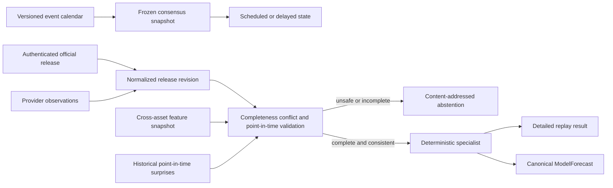
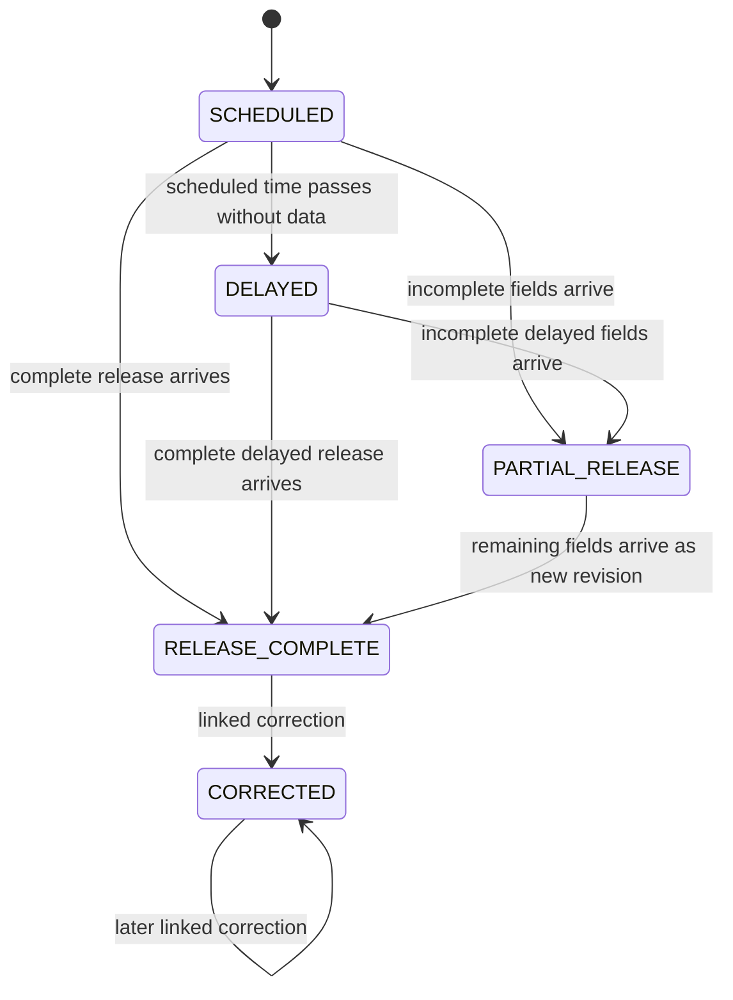

# Macroeconomic release specialist

The macroeconomic subsystem is a deterministic near-real-time Python component
outside the execution hot path. It supports CPI, PPI, employment reports, GDP,
retail sales, FOMC decisions, Federal Reserve statements, Treasury auctions,
and PMI releases. It publishes only advisory common forecasts and cannot create
or transmit an order.



## Calendar and normalized fields

Each calendar event has a stable event ID, event type, calendar version,
scheduled wall-clock UTC nanoseconds, and bounded expected-field list. An exact
field identity includes:

- event type and provider-independent field ID;
- headline, core, or subcomponent role;
- explicit integer unit;
- reference period;
- seasonal-adjustment convention; and
- annualization convention.

The initial units are percent PPM, rate basis points, index milli-units,
currency millions, quantity thousands, and ratio PPM. Binary floating point is
not accepted. Calendar field definitions also carry a reviewed target-direction
sign and fixed-point forecast weight. They are data, never executable text.

## Consensus freeze and temporal integrity

`MacroConsensusSnapshot` is immutable and content-addressed. Its freeze time is
strictly earlier than the scheduled release, and every estimate and supporting
source receipt must precede the freeze. `FrozenMacroEventProcessor` pins the
snapshot digest for the event and rejects consensus changes after processing
begins.

The contract never conflates:

- scheduled release wall-clock UTC time;
- official publication wall-clock UTC time;
- local receipt wall-clock UTC time;
- feature as-of exchange event time; and
- local production/expiration monotonic time.

A release earlier than its scheduled time is rejected by this initial strict
policy. A late release remains delayed until it arrives; once complete and
validated, it can publish with `DELAYED_RELEASE` retained as an informational
reason.

## Actuals, priors, revisions, and corrections

Official and provider observations retain exact source excerpts, raw and
sanitized content hashes, source event identity, authentication, source quality,
publication time, and receipt time. Only the authenticated official observation
is the actual. A differing provider observation causes strict abstention.

Prior fields store both `value_known_before_release` and the optional
`revised_value_in_release`. Revision calculations never overwrite or backdate
the earlier value. Corrections have increasing revisions and a SHA-256 link to
the prior release. The processor rejects stale or broken lineage and requires
the original frozen consensus digest.

## Calculations

Headline, core, and subcomponent surprise values use:

```text
surprise_ppm = (actual - consensus) * 1,000,000
               / max(dispersion, configured_unit_epsilon)
```

Revision surprise is the relative signed change from the prior value known
before release. The surprise percentile is an empirical signed percentile over
same-event-type historical headline surprises that were available before the
current consensus freeze. All division truncates toward zero.

Cross-asset response features preserve the raw value and unit and add a bounded
normalized magnitude. The snapshot covers:

- equity-index futures;
- Treasury futures or yields;
- FX proxies;
- volatility instruments; and
- sector ETFs.

Response windows must straddle the actual receipt time and end no later than the
feature snapshot availability time. The common forecast is bound to that exact
feature snapshot.

## State and strict abstention



`SCHEDULED`, `DELAYED`, and `PARTIAL_RELEASE` always abstain. Complete states
also abstain for missing required fields or consensus, incompatible identities,
provider conflicts, insufficient history, bad source trust, or missing/invalid
cross-asset groups. An abstention has a detailed canonical result but no
forecast ID, lifetime, direction, return, volatility, or forecast bytes.

Complete safe results publish the existing versioned `ModelForecast` with
feature/config/model provenance and monotonic expiration. Calibration remains
zero because the baseline is infrastructure validation, not evidence of
economic value.

See [ADR 0017](../adr/0017-frozen-consensus-macro-specialist.md), the
[failure runbook](../operations/macroeconomic-release-failure-runbook.md), and
the [testing guide](../testing/macroeconomic-release-testing.md).
