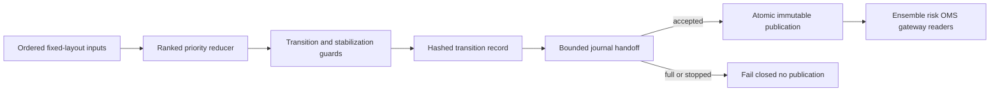

# Authoritative market-state controller

The market-state controller is a single-writer, allocation-free `edge-core`
state reducer. It converts validated point-in-time observations into one
immutable state consumed by decision and control components.

## Input ownership and units

`MarketStateInput` contains explicit process monotonic and wall-clock UTC times.
Input sequence is strictly increasing; process monotonic time is nondecreasing.
Calendar release times use wall-clock UTC because they describe scheduled civil
events. Dwell and stabilization use process monotonic time exclusively.

Volatility, OOD, and disagreement use integer PPM. Spread uses nonnegative
integer ticks and depth uses integer aggregate quantity units. Unknown enum
values, invalid PPM, zero sequences/times, invalid calendar shape, sequence
regression, and monotonic regression fail to `DATA_DEGRADED`. A recognized
official halt/close still forces `HALTED` when the containing observation is
malformed or out of order. Such an observation is journaled with its supplied
source sequence, while the accepted-input watermark does not move backward.

Producer mappings are narrow and explicit:

- official trading status comes from authenticated normalized venue status;
- feed health maps from the feed-handler `DataQualityState`;
- book validity maps from the order-book immutable view;
- clock quality maps from the temporal-integrity state machine;
- news, earnings, and macro inputs are cached intelligence state, never a
  synchronous RPC or Python call; and
- kill, recovery, and shutdown controls are versioned operator/control-plane
  observations delivered to the edge.

## Priority table

The first matching group wins. Reasons within a common output state remain
distinct and are atomically updated.

| Rank | Condition | Output | Primary reason examples |
| ---: | --- | --- | --- |
| 1 | Official `HALTED` or `CLOSED` | `HALTED` | `OFFICIAL_HALT`, `OFFICIAL_MARKET_CLOSED` |
| 2 | Clock `UNSAFE` or `UNKNOWN` | `DATA_DEGRADED` | `CLOCK_UNSAFE`, `CLOCK_UNKNOWN` |
| 3 | Unknown official status; invalid, stale, unknown, or degraded feed/book/clock; overdue scheduled release | `DATA_DEGRADED` | `OFFICIAL_STATUS_UNKNOWN`, `FEED_INVALID`, `BOOK_INVALID`, `SCHEDULED_RELEASE_OVERDUE` |
| 4 | Kill switch engaged | `DATA_DEGRADED` | `KILL_SWITCH_ENGAGED` |
| 5 | Pre-open/auction, recovering feed/book, syncing clock, recovery control | `REOPENING` or `RECOVERY` | `REOPENING_AUCTION`, `FEED_RECOVERING` |
| 6 | Breaking news, active release/price discovery, pre-release calendar window | Event states | `NEWS_BREAKING`, `EVENT_PRICE_DISCOVERY`, `MACRO_SCHEDULED` |
| 7 | Volatility/spread/depth/OOD/disagreement threshold, otherwise healthy | `VOLATILITY_SPIKE` or `NORMAL` | Threshold reason or `NORMAL_CONDITIONS_STABLE` |

`SHUTDOWN` is terminal lifecycle state. For a new evaluation, a recognized
official halt/close is inspected before a simultaneous shutdown request; after
`SHUTDOWN` is published, later inputs cannot leave it.

## Transition table

Self-transitions are permitted for reason changes. “Event states” means
`SCHEDULED_EVENT`, `BREAKING_NEWS`, `EVENT_PRICE_DISCOVERY`, and
`VOLATILITY_SPIKE`.

| From | Allowed destinations |
| --- | --- |
| `STARTUP` | `STARTUP`, `HALTED`, `DATA_DEGRADED`, `REOPENING`, `RECOVERY`, `SHUTDOWN` |
| `NORMAL` | `NORMAL`, all event states, `HALTED`, `DATA_DEGRADED`, `REOPENING`, `RECOVERY`, `SHUTDOWN` |
| Any event state | `NORMAL`, all event states, `HALTED`, `DATA_DEGRADED`, `REOPENING`, `RECOVERY`, `SHUTDOWN` |
| `DATA_DEGRADED` | `DATA_DEGRADED`, `HALTED`, `REOPENING`, `RECOVERY`, `SHUTDOWN` |
| `HALTED` | `HALTED`, `DATA_DEGRADED`, `REOPENING`, `RECOVERY`, `SHUTDOWN` |
| `REOPENING` | `REOPENING`, `HALTED`, `DATA_DEGRADED`, `RECOVERY`, `SHUTDOWN` |
| `RECOVERY` | `RECOVERY`, `NORMAL`, all event states, `HALTED`, `DATA_DEGRADED`, `REOPENING`, `SHUTDOWN` |
| `SHUTDOWN` | `SHUTDOWN` only |

The test suite evaluates all 121 state pairs against this table. It also runs a
fixed-seed randomized sequence and asserts that no published record violates
the matrix. In particular, `HALTED -> NORMAL` and `DATA_DEGRADED -> NORMAL` are
impossible.

## Stabilization behavior

Safety escalations do not wait for dwell. When halt or invalid state clears, the
controller first enters recovery. Exiting `REOPENING` starts a continuous
reopening stabilization timer only after status leaves pre-open/auction. Exiting
`RECOVERY` starts a continuous recovery stabilization timer only after all
recovery predicates clear. Seeing a recovery predicate again resets its timer.

Normal, resolved-news, and operator-requested exits from an event or volatility
regime must satisfy `minimum_dwell_ns` before entering `RECOVERY`. A feed, book,
or clock recovery predicate, breaking-news escalation, active release, official
halt, or unsafe input does not wait for this timer.

## Atomic publication and journaling

Snapshots and transitions carry schema `1.0`, ordered input/transition
sequences, reason bitmask, timestamp domains, configuration hash, previous/next
snapshot hashes, and a transition-record hash. FNV-1a over fixed integer words
is used for deterministic corruption detection, not cryptographic security.

The controller is the sole writer. It appends a transition to its mandatory
bounded journal sink, then release-publishes the immutable atomic image. Readers
retry at most eight times and reject empty, invalidated, busy, or corrupt state.
Journal rejection returns a fail-closed evaluation with
`new_orders_permitted=false`, invalidates atomic reads, and leaves the previous
bytes unchanged for audit. The next accepted fresh evaluation is forced through
journal and publication before readers can receive a snapshot again.

See [ADR 0020](../adr/0020-authoritative-market-state-controller.md), the
[failure runbook](../operations/market-state-controller-failure-runbook.md), and
the [testing guide](../testing/market-state-controller-testing.md).
