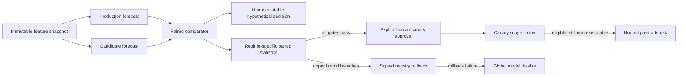
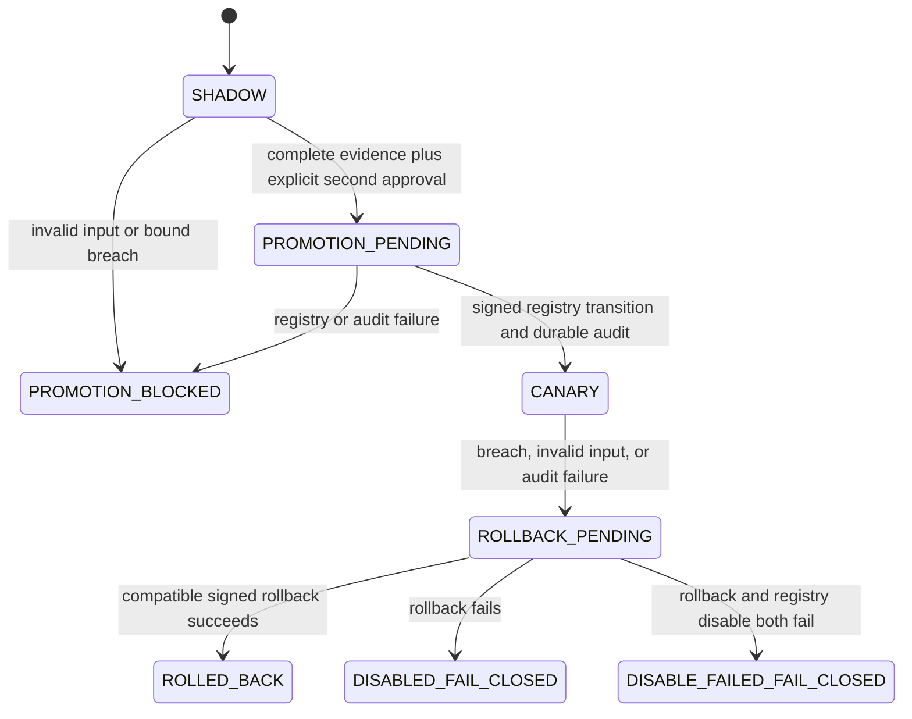

# Shadow, canary, and automatic model rollback

## Boundary and safety posture

The deployment coordinator is an asynchronous Go control-plane library layered
on the [signed model registry](model-registry.md). It receives recorded paired
forecast observations and controls only candidate lifecycle and a bounded canary
eligibility envelope. It has no inference RPC, strategy, order constructor,
account, venue, OMS, gateway, socket, or live-transmission capability.



No arrow from the comparator or limiter reaches an order gateway. `eligible`
means only that candidate evaluation is inside the signed symbol, strategy,
capital, rate, and risk-freshness envelope. Market state, kill switches, risk,
OMS, and the gateway final gate remain independent and authoritative.

## Signed deployment contract

`DeploymentConfig` binds the exact production/candidate semantic versions and
feature schema to:

- required market regimes;
- exactly one threshold and minimum sample count for each rollback metric;
- fixed PPM critical value for the confidence interval;
- canary instrument and strategy allowlists;
- maximum capital in currency nanos;
- maximum requests per monotonic nanosecond window;
- maximum risk-snapshot age;
- initial approver, external approval reference, and automatic rollback actor;
  and
- schema version, creation UTC time, deployment ID, and canonical SHA-256.

The finalized configuration sorts all set-like fields, rejects unknown metrics
or regimes, and is accepted only with a trusted Ed25519 signature. Changing one
limit, version, schema field, or ordering invalidates the digest/signature.

## Paired observation and statistical rule

Production and candidate samples must identify the exact same feature snapshot
ID, snapshot SHA-256, and exchange event as-of timestamp. Each sample also binds
its forecast/model version, completion monotonic time, deadline, explanatory
action, robust edge, and bounded integer metrics. Late deadline state is derived,
not trusted from a caller-supplied Boolean.

For metric observations `x_i = candidate_i - production_i`, the coordinator
computes the paired mean and a conservative one-sided bound:

```text
SE = sqrt((n * sum(x_i^2) - sum(x_i)^2) / (n^2 * (n - 1)))
upper = ceil(mean) + ceil(z * SE)
trigger = n >= minimum_samples AND upper > maximum_regression
```

All sums, products, divisions, and square roots use exact arbitrary-precision
integer arithmetic with conservative outward rounding. Statistics are separate
for every configured regime. The ten mandatory dimensions are latency, deadline
misses, calibration, feature drift, OOD, trade rate, disagreement,
implementation shortfall, P&L-attribution anomaly, and risk-limit pressure.
There is no raw aggregate P&L input.

The configured normal critical value does not make samples independent or the
interval universally valid. An organization-approved experiment plan must set
sample sizes, critical values, sequential-testing policy, and regime definitions
before production use.

## State and authorization



There is intentionally no automatic promotion transition and no transition to
`LIMITED_RISK` or `PRODUCTION`. The canary approver must differ from the signed
configuration approver and provide an external approval reference plus the exact
configuration hash. The resulting registry lifecycle event retains the approval
reference. `DISABLE_FAILED_FAIL_CLOSED` still blocks the local coordinator but
does not claim a durable registry disable; it requires immediate independent kill
controls and operator response.

## Canary scope

`AdmitCanaryScope` is local, bounded, serialized, and monotonic. It rejects an
unknown/replayed sequence, regressed time, stale/invalid risk snapshot, denied
symbol or strategy, capital overflow/excess, or exhausted rate window. Every
decision is audited. Invalid requests do not roll replay protection backward.
An admitted decision always returns `order_executable=false` and
`downstream_risk_required=true`.

## Audit, restart, and metrics

The control audit uses strict JSONL envelopes with monotonic sequence,
previous-record hash, record SHA-256, fsync, and parent-directory sync. The full
paired observation, hypothetical decision hash, interval trigger, approvals,
scope requests/decisions, rollback, and fail-closed disable are immutable.
Corruption is reported and the original is never repaired in place.

An active canary refuses startup unless its sink can read a valid matching audit.
Recovery reconstructs observations, exact accumulators, scope sequence/time,
current rate window, rejection/rollback counters, last trigger, and run state.
The registry lifecycle and recovered state must agree.

The v1 audit sink has exactly one coordinator process owner. It provides an
in-process mutex but no multi-process lease or consensus. Deployment must enforce
single-writer identity/fencing externally; multi-host coordination remains a
control-plane prerequisite and an unknown writer state is fail-closed.

`WritePrometheus` provides bounded-cardinality state, observation, rollback,
scope-rejection, per-regime sample, mean, upper-bound, threshold, and trigger
series. The dashboard is
[`infra/observability/grafana/dashboards/model-deployment.json`](../../infra/observability/grafana/dashboards/model-deployment.json).
Exporter I/O is a future service-shell integration and must never run in a model
inference or order loop.

Operational response is in the
[shadow/canary rollback runbook](../operations/model-deployment-rollback-runbook.md),
focused verification is in
[model deployment testing](../testing/model-deployment-testing.md), and the
decision is [ADR 0032](../adr/0032-paired-regime-aware-model-deployment-control.md).
