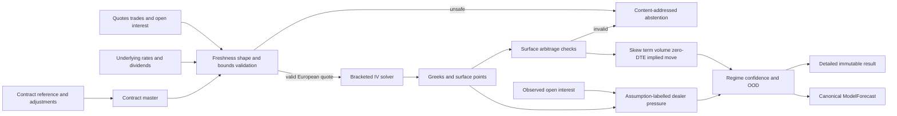

# Options analytics signal service

The options subsystem is a deterministic near-real-time Python signal service
outside the execution hot path. It observes options and underlying state,
publishes advisory volatility forecasts through the common contract, and has no
route to order entry.



## Contracts and units

`OptionsInputBundle` binds session, underlying, feature snapshot, configuration,
contract-master revisions, one consolidated quote per contract, trades, open
interest, underlying midpoint, carry, wall-clock cutoff, and monotonic production
time. Currency values are integer nanos; quantities are integer contracts or
deliverable units; rates, volatility, confidence, OOD, ratios, and distributions
are integer PPM.

Exchange event time, NIC receive time, wall-clock UTC receipt/availability time,
and process monotonic production/expiration time are distinct fields. Freshness
is calculated only from comparable wall-clock receipt and as-of fields.

The public symbol parser accepts the 21-character OSI representation: six root
characters padded on the right, `YYMMDD`, `C` or `P`, and eight strike digits in
currency thousandths. This is public symbology, not a feed protocol. OCC records
the industry OSI transition and its adjusted-symbol conventions in
[OCC memo 26853](https://infomemo.theocc.com/infomemos?number=26853); provider
wire formats remain outside this implementation.

## Pricing and implied volatility

The first numerical slice uses the Black–Scholes–Merton European formula with
continuous dividend yield. It follows the no-arbitrage construction introduced
by Black and Scholes in
[The Pricing of Options and Corporate Liabilities](https://www.journals.uchicago.edu/doi/10.1086/260062).
It is not used for American exercise.

For time `T` in ACT/365F years:

```text
d1 = [ln(S/K) + (r - q + sigma^2/2) T] / (sigma sqrt(T))
d2 = d1 - sigma sqrt(T)
call = S exp(-qT) N(d1) - K exp(-rT) N(d2)
put  = K exp(-rT) N(-d2) - S exp(-qT) N(-d1)
```

Before inversion, the midpoint must lie within discounted European lower and
upper bounds. IV inversion is monotone bounded bisection over configured integer
volatility PPM with finite iterations, price tolerance, and volatility
tolerance. Newton steps are not used. A price at the lower bound maps to zero IV
but is rejected for surface/Greeks publication because its sensitivities are not
stable.

Delta, gamma, and vega are analytic. Vanna is the volatility derivative of
delta; charm is the negative time-to-expiry derivative of delta. Both use small
bounded symmetric differences and are labeled approximate.

## Surface and feature semantics

Only valid quotes form points. The surface checks:

- configured minimum points and expirations;
- call/put monotonicity and strike convexity at an expiration; and
- nondecreasing total variance across expirations for an identical strike/right.

The initial surface is a deterministic point set, not a smoothing or
extrapolation model. Skew is put-wing median IV minus call-wing median IV. Term
structure is far-expiry median IV minus near-expiry median IV. Unusual volume is
observed trade volume divided by observed open interest, capped at one million
PPM. Zero-DTE concentration is the share of observed trade volume expiring by
the end of the current UTC date. Implied move is the nearest-expiry,
nearest-strike observed straddle divided by spot.

## Dealer-pressure inference

Open interest, contract multiplier, and calculated Greeks are inputs to gross
one-percent gamma/vanna and one-day charm shock approximations. Dealer sign is
never observable from these fields. The default `UNKNOWN_SYMMETRIC` result has
zero signed exposure, symmetric positive/negative probabilities, and maximum
assumption uncertainty. Configured long/short assumptions produce different
signed values and distributions without changing the observed fields.

Pinning pressure is an inferred concentration ratio of gamma-weighted observed
open interest by strike. It is not a measurement of dealer inventory or future
market behavior.

## Publication and service behavior

An insufficient, invalid, or numerically failed surface produces an abstention
artifact and no forecast bytes. A safe surface publishes expected volatility
through `ModelForecast` with exact model, feature, configuration, instrument,
as-of, production, expiration, confidence, data-quality, and OOD provenance.
The return fields are zero and the direction distribution is flat because this
service forecasts volatility, not direction.

`OptionsSignalService` exposes version, health, readiness, configuration hash,
fixed-cardinality metrics, bounded structured audit events, and graceful
shutdown. It performs no network or disk calls during evaluation and cannot
restart within the same stopped process epoch.

See [ADR 0018](../adr/0018-assumption-labelled-options-analytics.md), the
[failure runbook](../operations/options-analytics-failure-runbook.md), and the
[testing guide](../testing/options-analytics-testing.md).

