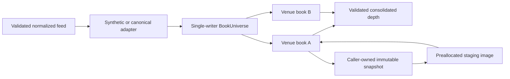
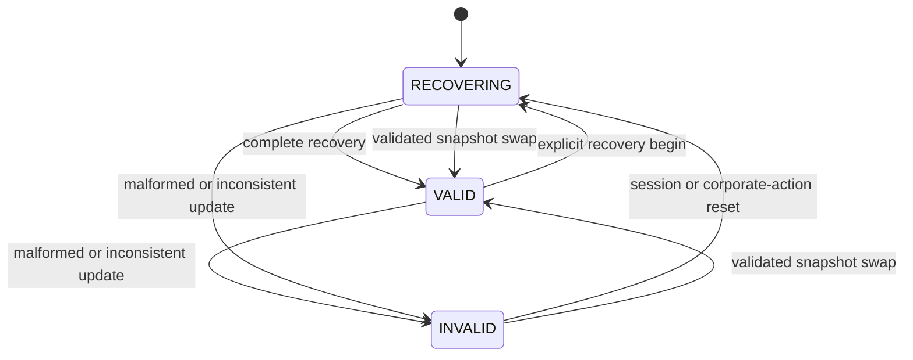

# Deterministic order-book engine

The `aegis::order_book` library consumes sequence-valid market updates and owns
per-venue book state. It implements no strategy, risk decision, OMS behavior,
gateway, socket, or live-trading capability.

## State ownership

The thread that constructs a book or universe is its sole owner. Every mutable
operation and query checks this ownership. Cross-thread consumers must receive a
copied `DepthSnapshot`, `TopOfBook`, or `BookSnapshot` through a bounded publisher
owned by the caller. No internal locks, background threads, callbacks, or logging
exist.

## Storage and latency model

An order-by-order book contains a fixed order pool, a fixed open-addressed index,
sorted contiguous levels, and intrusive FIFO queues. A price-level book uses the
same contiguous level storage without order slots. Runtime capacities are
validated against compile-time hard bounds:

| Resource | Hard bound |
| --- | ---: |
| Orders per book | 4,096 |
| Levels per side | 512 |
| Published depth per side | 64 |
| Books per universe | 64 |

Construction allocates the active and staging images once. Steady-state update,
clear, query, consolidation, invariant, and snapshot-load paths do not allocate.
Existing-level mutations and top queries touch contiguous local state. New-level
insertion and deletion shift at most the configured level capacity. Clear and
full invariant checks scan bounded capacity and are not intended as per-message
diagnostics in production.

## Update rules

- Adds append to the tail of their price queue. Duplicate live IDs are rejected.
- Partial cancel and partial execute preserve priority and require a quantity
  strictly below the remaining quantity.
- Full cancel, execute, and delete remove the order and empty level when needed.
- Replace changes price, side, or quantity and always appends with new priority.
- Price-level set replaces the complete aggregate quantity and count.
- Trade records tape state without changing depth.
- Status and auction events maintain independent state. Halted and closed books
  reject normal mutations.
- Clear-side and clear-book remove all affected order and aggregate state.

Every accepted event advances the version and last valid sequence. Shared feed
channels commonly skip sequences between events for one instrument, so the
default is strictly newer modular ordering. `require_contiguous_sequence` is for
dedicated per-instrument streams; feed recovery owns shared-channel gap detection.

## Validity and recovery

Snapshot loading rebuilds the inactive image, verifies ordering, positivity,
capacity, queues, hashes, aggregates, crossing, session, mode, and identity, then
swaps images. A failed snapshot leaves active contents untouched but marks them
unsafe. Order-by-order snapshots must contain orders and aggregate levels;
price-level snapshots contain aggregate levels only.

Corporate actions are reset boundaries. The engine clears the book, changes the
session, binds the new reference-data version, and waits for recovery. It does not
guess split ratios, tick conversions, or venue adjustment behavior.

## Consolidated view

The universe merges equal prices with checked integer addition and keeps the best
configured depth in bid-descending and ask-ascending order. Every configured
constituent for the instrument must be valid. An invalid constituent, aggregate
overflow, or crossed consolidated result produces an explicit error and no valid
view.

## Synthetic and licensed boundaries

SMX/1 order messages map their private order IDs into a scoped canonical
`OrderId`; the adapter verifies the supplied post-update aggregate. Quotes advance
the consumed sequence without overriding the reconstructed top. Invalid data or
identity mismatch invalidates the destination book.

Canonical aggregate snapshots cannot restore order priority. Real order-by-order
snapshots, auction semantics, priority rules, and permitted crossed transitions
require licensed venue specifications and certification evidence.

## Related documents

- [ADR-0008](../adr/0008-bounded-single-writer-order-books.md)
- [Feed-handler framework](feed-handler.md)
- [Event contracts](event-contracts.md)
- [Order-book testing](../testing/order-book-testing.md)
