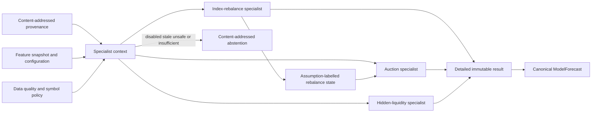

# Rebalance, auction, and hidden-liquidity specialists

These related specialists are deterministic, near-real-time advisory models
outside the execution hot path. They consume normalized, point-in-time data and
publish through the common forecast contract. They have no order-entry route.

## Common context and safety behavior

`SpecialistContext` binds the event, session, instrument, feature snapshot,
configuration, wall-clock cutoff, exchange event time, process monotonic
production time, data-quality score, provenance set, and symbol policy. Each
source has a nonzero content hash, authentication state, receipt time, source
quality, and either an event wall time or exchange event time.

Inputs unavailable at the cutoff are rejected during construction. Evaluation
abstains on disabled symbols, low effective quality, unauthenticated sources,
stale state, or insufficient history/evidence. Published forecasts expire on a
monotonic deadline. Detailed input and output records use schema version
`1.0.0` and canonical SHA-256 identities.

All currencies are integer currency nanos; prices used for hidden-liquidity
candidates are integer ticks; shares, contracts, and auction sizes are integer
quantities; ratios, probability, confidence, impact, and uncertainty use integer
parts per million. Division truncates toward zero and quantiles use a documented
nearest-rank integer rule.

## Index-rebalance specialist

The initial interpretable estimate applies the announced weight delta to an
estimated asset base, then bounds tracker participation and asset uncertainty.
ETF flow and historical closing-auction participation affect uncertainty and
the share of flow assigned to the closing auction. Historical signed impact and
reversal observations produce an impact distribution and reversal probability.

The result includes a signed passive-flow range, timing window, signed auction-
demand range, price-impact quantiles, reversal probability, uncertainty, and an
explicit `PassiveFlowAssumption`. Provider announcement, tracker assets, ETF
state, and historical observations remain separate provenance sources.

## Auction specialist

The auction specialist combines the observed signed imbalance with an active
rebalance-demand range. It scales historical clearing residuals by current
imbalance relative to forecast volume, then produces integer clearing-price
quantiles. Historical eligible-fill observations and current paired quantity
produce a fill probability. The participation cap is the minimum of configured
volume participation and an uncertainty-adjusted paired-quantity cap.

`QUEUE_PRIORITY_UNKNOWN` is the conservative default. `PRO_RATA_APPROXIMATION`
must be explicitly selected; neither assumption represents venue allocation as
known. The cap is model advice only and cannot bypass ensemble or deterministic
risk.

## Hidden-liquidity specialist

The hidden-liquidity specialist scores repeated executions, displayed-depth
replenishment, partial-fill sequences, and repeated displayed size at one venue,
price, and resting side. Venue baseline and false-positive priors reduce the
score. Observed execution and replenishment quantities bound an inferred latent
range; post-execution impact reduces persistence and confidence.

Every output uses `REPLENISHMENT_IS_INFERENTIAL`. The result says “iceberg
probability” and “latent-size range”; it never claims an observed iceberg,
dealer identity, order owner, or exact reserve quantity.

## Ownership and integration

The implementation is in
`python/intelligence/aegis_mx_intelligence/market_specialists.py` and
`market_specialists_types.py`. A future intelligence host owns scheduling,
bounded ingress, service lifecycle, and telemetry. It may write forecasts to a
cache; the colocated hot path may only read validated, unexpired cached
forecasts. There is no synchronous Python or RPC work in an execution loop.

See [ADR 0019](../adr/0019-provenance-bound-market-specialist-inference.md), the
[failure runbook](../operations/market-specialists-failure-runbook.md), and the
[testing guide](../testing/market-specialists-testing.md).
