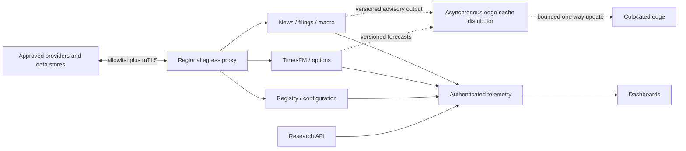

# Regional Kubernetes deployment

## Scope and safety boundary

The regional cluster hosts asynchronous and near-real-time services only. It
cannot submit orders, call a gateway, satisfy edge risk readiness, or become an
edge leadership witness. Forecast and intelligence delivery is asynchronous;
the colocated path reads validated versioned caches and never blocks on this
cluster.

| Namespace | Services | Timing class | Production replicas / scaling |
| --- | --- | --- | --- |
| `aegis-intelligence` | news, filings, macro | Near-real-time | 3/3/2; bounded HPA to 10/8/6 |
| `aegis-models` | TimesFM, options analytics | Asynchronous forecast | TimesFM 2 GPU, fixed; options 3, HPA to 8 |
| `aegis-control` | model registry, configuration control plane | Administrative | 3 each, fixed |
| `aegis-observability` | dashboards | Asynchronous | 2, fixed |
| `aegis-research` | research API | Offline-facing API | 2, HPA to 6 |

The base resources are in [`infra/regional/base`](../../infra/regional/base).
Local and production composition uses Kustomize overlays. The older standalone
TimesFM manifest remains backward-compatible reference material; new regional
deployments use the unified base.

## Identity, secrets, and networking

Each workload has one ServiceAccount with token automount disabled. TLS
certificate, private key, trust bundle, and any datastore credential are
resolved by a site-owned `SecretProviderClass` and exposed only through the
read-only `/var/run/aegis-mx/identity` CSI mount. Configuration contains logical
endpoints, never secret bytes.

Every namespace has a deny-all ingress/egress policy. Explicit policy permits:

- mTLS-labeled callers in the same namespace on TCP 8443;
- authenticated observability readers on TCP 8443;
- the platform ingress class for authorized regional APIs;
- cluster DNS;
- the OpenTelemetry collector on TCP 4317; and
- a regional egress proxy on TCP 8443.

There is no direct arbitrary Internet, exchange, broker, or colocated-edge
route. Provider and datastore access is authenticated again by the egress proxy
and destination service. Network labels never substitute for certificate RBAC.

The cache distributor and external egress platform are integration boundaries,
not deployed by this phase.

## Scheduling and lifecycle

All containers declare CPU, memory, and ephemeral-storage requests and limits.
Pods spread across zones and prefer different hosts. Production disruption
budgets preserve at least one replica, or two for three-replica services.
Rolling updates use `maxUnavailable: 0`, `maxSurge: 1`, minimum readiness dwell,
bounded progress deadlines, and a pre-stop drain. Startup, liveness, and
readiness probes call the image-owned `service-healthcheck`; readiness must
validate configuration, identity, dependencies, build version, and model state.

TimesFM production pods request and limit exactly one `nvidia.com/gpu`, use the
`nvidia` RuntimeClass, select `aegis-mx.io/gpu-inference=true` nodes, and tolerate
only the GPU taint. News and filing pods use the production
`aegis-untrusted-documents` RuntimeClass for kernel-enforced sandboxing. Local
development removes that RuntimeClass and must use only mock/filesystem inputs.

## Image and configuration integrity

Every image reference is digest-shaped. Checked-in digests and evidence hashes
are deliberate zero placeholders at `registry.invalid`, making the base
non-runnable. The production admission policy rejects:

- image tags or zero/unresolved digests;
- missing signature-bundle or configuration evidence hashes;
- a pod with execution authority; and
- host-network, host-PID, or host-IPC access.

Before admission, the release controller performs cryptographic OCI signature,
CI identity, SBOM, provenance, and configuration verification and emits a
[regional release lock](../../schemas/regional-release-lock-v1.schema.json).
`regional-deployment validate-release-lock` validates that immutable handoff.
The cluster requires a separately operated cryptographic image-signature
admission verifier; the native policy verifies evidence presence and safety
shape but is not itself a signature implementation.

## Observability and backups

Services expose build/version, health, readiness, configuration hash, bounded
Prometheus metrics, structured logs, and graceful shutdown through the common
service contract. OpenTelemetry export is the only general cross-namespace
egress. Authenticated collectors scrape metrics; unauthenticated Prometheus
annotations are intentionally absent.

The metadata backup policy requires a 15-minute database RPO, 120-minute RTO,
point-in-time recovery, object lock, encrypted daily exports, 35 daily / 12
weekly / 13 monthly retention, and monthly restore tests. The CronJob uses
`concurrencyPolicy: Forbid`, deadlines, bounded retries and resources, and an
isolated identity. Provider evidence and model artifacts are immutable objects
whose replication, retention, legal holds, and restoration are owned by their
systems of record. Dashboards and deployment declarations are restored from
signed source-control releases.
