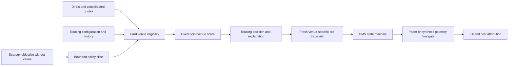

# Smart order router and execution policies

## Scope and safety boundary

The smart order router is a deterministic local planner for synthetic and paper
execution. It has no network, endpoint, credential, native protocol, gateway
reference, or transmission method. It does not authorize an order.



`ExecutionObjective` contains the execution goal, not a raw order: instrument,
side, policy, total/filled quantity, limit, time window, child cap, schedule
parameters, expected-alpha assumption, tick value, and forecast/feature/config
provenance. In particular it has no `VenueId`, `GatewayRequest`, or
`RiskDecision`.

`RoutingDecision` is only a proposed child. `requires_fresh_pretrade_risk` is
always true and validated. Downstream composition must create a new exact
venue-specific risk intent, obtain deterministic approval, enter OMS, and pass
the independent gateway final gate. A routing decision cannot be passed to
`IExchangeGateway` by type.

## Eligibility order

The router examines at most 16 preallocated venue observations. A candidate is
excluded before scoring when any of the following applies, in this order:

1. venue missing/disabled or policy disallowed;
2. route history already contains the venue;
3. regulatory configuration or observation denies eligibility;
4. required self-trade-prevention state is not explicitly clear;
5. venue is not `OPEN`, or not `AUCTION` for auction participation;
6. direct or consolidated quote is invalid, from the future, or stale;
7. configured route-latency limit is exceeded;
8. a venue named as consolidated best bid/ask disagrees with its direct price
   beyond the configured tick tolerance;
9. reject rate exceeds the burst threshold;
10. fill probability is below the configured floor;
11. cancel/replace does not refer to the working order's venue;
12. objective-level venue concentration has no capacity; or
13. price/quantity arithmetic or the limit-price constraint fails.

Unknown status, regulation, STP, freshness, and price validity fail closed.
Candidate explanations retain the observation hash and exact exclusion reason.

## Policy slices

Every slice is capped by remaining objective quantity, the objective child cap,
the venue child cap, and remaining venue concentration.

| Policy | Deterministic child behavior |
| --- | --- |
| Passive join | Join the direct same-side best without violating the limit. |
| Passive improve | Improve one tick, bounded inside the spread and by the limit. |
| Aggressive take | Use the direct executable opposite-side price. |
| Cancel/replace | On configured queue deterioration, replace one tick better when limit-valid; otherwise emit a protective cancel proposal. |
| IOC | Aggressive price with explicit `IMMEDIATE_OR_CANCEL` time-in-force. |
| Participation | `floor(observed interval volume * participation ppm / 1,000,000)`. |
| TWAP | Ceiling of remaining quantity divided by remaining fixed intervals; no slice before the next due time. |
| VWAP | Positive difference between cumulative curve target and filled plus already-scheduled quantity. |
| POV | Same bounded observed-volume formula as participation, applied to volume since the prior slice. |
| Auction | Auction price with quantity capped by `floor(paired quantity * participation ppm / 1,000,000)`. |

Zero observed volume, a not-yet-due interval, missing auction liquidity, completed
quantity, pre-start time, or expiry produces an explicit abstention. No internal
retry occurs. A request at or beyond `maximum_route_attempts`, or with all
candidates already visited, is a routing-loop abstention.

## Integer scoring formulas

Units are:

- price: integer ticks;
- quantity: integer units;
- value/cost: currency nanos per unit;
- alpha and adverse selection: microticks;
- probability: parts per million (`P = 1,000,000`); and
- time: process-monotonic nanoseconds.

Alpha is decayed by completed half-lives and a linear fixed-point interpolation
from 1 to 1/2 inside the current half-life. This is a deterministic compact
approximation, not a floating-point exponential:

```text
completed = floor(elapsed / half_life)
base      = alpha / 2^completed
fraction  = ppm(elapsed mod half_life, half_life)
alpha_d   = base * (P - fraction / 2) / P
```

Displayed plus estimated hidden quantity supplies a liquidity coverage factor.
For passive orders, queue ahead supplies an additional queue factor. Reject
probability is applied independently:

```text
liquidity     = displayed_quantity + estimated_hidden_quantity
queue_factor  = liquidity / (liquidity + queue_ahead)       # passive only
coverage      = min(1, liquidity / proposed_quantity)
fill_eff      = fill_probability * (1 - reject_rate)
                * queue_factor * coverage
fill_uncert   = 4 * fill_eff * (1 - fill_eff)
```

All ratios above are fixed-point ppm with checked products. Let `price_edge` be
the side-adjusted difference between the candidate price and the corresponding
consolidated reference, and let a signed fee be positive for a fee and negative
for a rebate:

```text
gross_if_filled = alpha_d + price_edge - adverse_selection - fee
opportunity     = max(alpha_d, 0) * (1 - fill_eff)
uncertainty_pen = configured_penalty * fill_uncert
expected_value  = gross_if_filled * fill_eff
                  - opportunity - uncertainty_pen
```

Passive and aggressive values are both recorded when their prices are valid;
the policy selects the applicable value. Venue latency affects `alpha_d`.
Highest expected value wins. Exact ties use lower configured `tie_break_rank`,
then lower canonical `VenueId`. A negative score is not silently converted into
another strategy decision: a valid mandatory execution objective may still
need execution, while risk and market-safety controls remain authoritative.

## Cost attribution

`execution_cost_attribution` uses checked integer arithmetic for side-adjusted
arrival-to-decision spread cost, decision-to-fill slippage, modeled impact,
fill-to-post-fill adverse selection, unfilled opportunity cost, explicit fees,
and total cost. Negative component values represent improvement/savings. The
record binds objective and venue IDs and has a stable hash.

These components are accounting labels for the configured synthetic/paper
model; some modeling definitions can overlap. They do not establish real venue
economics or predictive value.

## Ownership, resources, and observability

One owner thread calls a `SmartOrderRouter`. Requests, venue explanations, route
history, and outputs are fixed-size and trivially copyable. The steady-state
path performs bounded loops, checked integer arithmetic, and no intentional
allocation, logging, RPC, disk I/O, or clock read. Time is injected in the
request.

The library exposes build information, configuration hash, readiness/health,
fixed-cardinality metrics, and shutdown. Metrics cover requests, routes,
abstentions, invalid input, and hard exclusions for stale quotes, halted venues,
reject bursts, STP, concentration, and loops. A deployable composition root must
export them without blocking this path.

## Licensed boundary and limitations

The scoring and paper assumptions are provider-neutral infrastructure
validation. Real venue order types, fee/rebate schedules, regulatory routing
obligations, self-trade modes, queue priority, reject semantics, auction rules,
hidden liquidity, routing restrictions, and certification remain blocked on
authorized specifications and compliance approval. See
[Licensed Integration Boundaries](licensed-integration-boundaries.md).

Durable route-decision journaling and faithful end-to-end replay are Phase 10
dependencies. The decision already binds objective, request, configuration, and
observation hashes so that integration can preserve exact provenance.
