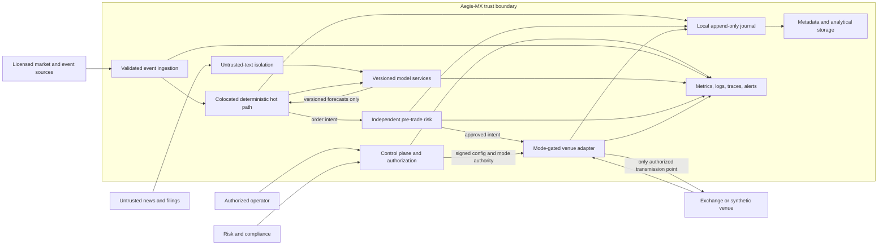

# Aegis-MX System Context

| Field | Value |
| --- | --- |
| Status | Initial architecture baseline |
| Date | 2026-08-28 |
| Scope | Target boundaries and information flows; no trading functionality is implemented by this document |

## Mission

Aegis-MX is an event-aware, multimodel intraday trading platform. It consumes
licensed or synthetic market and event data, produces versioned model forecasts,
combines them under deterministic policy, applies independent pre-trade risk,
and may ultimately route authorized orders through venue adapters. The system is
designed so that bad data, late models, loss of authority, failed risk services,
invalid clocks, and operational partitions result in rejection or halted
transmission rather than unsafe trading.

The [engineering contract](engineering-contract.md) is normative. This context
document names target components and trust boundaries; it does not select venue
protocols, vendors, deployment topology, latency objectives, or risk limits.
Those decisions require separate ADRs and measured evidence.

The initial safety boundaries and two-stage live-activation decision are recorded
in
[`../adr/0001-safety-boundaries-and-live-activation.md`](../adr/0001-safety-boundaries-and-live-activation.md).

## Context diagram



Arrows show logical information flow, not synchronous calls. In particular,
external RPC, persistence, analytical storage, Python, and LLM processing are
outside the innermost hot path.

## People and external systems

| Actor or system | Responsibility | Trust posture |
| --- | --- | --- |
| Authorized operator | Reviews state, authorizes bounded mode changes, activates kill switches, and responds to incidents | Authenticated but fallible; no single action bypasses interlocks |
| Risk and compliance | Owns risk policy, surveillance requirements, restricted instruments, and approval evidence | Independent authority; fail closed if required authority is unavailable |
| Market and reference-data providers | Supply sequenced market, instrument, calendar, corporate-action, and status data | Untrusted until licensed, authenticated, decoded, sequenced, and validated |
| News and filing sources | Supply event text and metadata | Hostile-content boundary; text is data and cannot issue instructions |
| Time infrastructure | Supplies PTP/hardware time and clock-health evidence | Safety-critical dependency; uncertain synchronization revokes trading readiness |
| Exchange or synthetic venue | Receives orders and returns acknowledgements, fills, rejects, and status | Adapter boundary; protocol details require authorized specifications |
| Identity/configuration authority | Signs deployable configuration and grants scoped operator identities | Safety-critical; signatures, freshness, scope, and revocation must be validated |
| Storage and observability systems | Receive metadata, journal replicas, analytics, metrics, logs, traces, and alerts | Off-hot-path; loss cannot grant authority or silently discard required audit evidence |

## Logical component responsibilities

### Validated event ingestion

Ingestion authenticates and decodes a source through a versioned adapter,
validates schemas and instrument identity, detects sequence gaps and duplicates,
tracks freshness, and constructs a canonical event order using validated event
timestamps and deterministic tie-break rules. It publishes explicit valid,
degraded, stale, and invalid state. Unknown or malformed state is invalid.

Market-book builders own book consistency checks, snapshot/recovery handling,
trading-status events, and stale-data deadlines. They do not infer missing venue
semantics. Until licensed specifications are available, only synthetic/reference
formats may be implemented.

### Untrusted-text isolation

The news and filings pipeline runs outside the execution hot path and outside
privileged control boundaries. It retains source provenance, treats embedded
instructions as content, constrains model output to a validated schema, and has
no credentials or tools capable of changing trading mode or submitting orders.
Sanitized structured events may feed models only after validation and freshness
checks. Raw external text never becomes configuration or an operator command.

### Models and forecast boundary

Models consume immutable, identified feature snapshots and publish through a
common versioned forecast contract. Forecasts include validity deadlines and are
discarded when late, malformed, incompatible, or detached from the expected
feature/event identity. Models have no route to the gateway. Python and LLM
inference remain off the hot path.

### Deterministic decision and ensemble core

The colocated C++ hot path consumes validated event state, immutable feature
snapshots, and on-time forecasts. A versioned ensemble/policy produces a
deterministic order intent or a reasoned no-action result. It uses bounded,
preallocated data structures and does not wait for missing forecasts or external
services. A replay given identical canonical inputs and versions must produce
the same output.

### Independent pre-trade risk

Pre-trade risk is the mandatory boundary between order intent and gateway. It
evaluates integer prices and quantities against a versioned, immutable risk
snapshot and returns deterministic approval or rejection with reason codes.
Risk service health and snapshot validity are distinct live-trading interlocks.
Strategy, model, ensemble, and operator preferences cannot override a rejection.

### Mode-gated venue adapter

The gateway is the only component permitted to transmit orders. It starts in
`SIMULATION` or `PAPER`, validates the complete live-activation predicate, and
enforces trading-status, book-validity, data-freshness, split-brain, clock,
kill-switch, and risk gates at the final transmission boundary. Restart never
restores live authority implicitly.

Adapters separate internal order types from venue messages. Licensed protocol
details may be added only from repository-authorized specifications. Synthetic
and reference adapters must be visibly labeled and incapable of reaching a real
venue.

### Journal, storage, and replay

The hot path hands audit records to a bounded, nonblocking journal mechanism.
The local append-only binary journal records canonical inputs, decisions,
rejections, risk outcomes, gateway state, and venue responses with checksums and
version identifiers. Off-path processes validate and copy journal segments to
object storage and analytical systems. PostgreSQL stores metadata; a
ClickHouse-compatible interface supports analysis. Neither is a hot-path
dependency.

Replay reconstructs decisions from journaled identities and artifacts. Replay
must distinguish faithful reproduction from counterfactual research and must
never transmit to a venue.

### Control plane and observability

The control plane distributes signed, versioned configuration and scoped
operator actions. It exposes state but cannot make a gateway live without every
independent interlock. All services expose build identity, health, readiness,
configuration hash, bounded metrics, structured logs, and graceful shutdown.

Observability exporters are isolated from the hot path. Telemetry overload may
drop explicitly classified diagnostic data according to policy, but must not
silently lose required activation, risk, decision, or transmission audit
records. The exact fail-safe policy for unavailable mandatory journaling requires
an ADR before order transmission exists.

## Primary information contracts

The following contracts are required and SHALL be independently versioned before
their producers and consumers are implemented:

| Contract | Minimum semantic content |
| --- | --- |
| Source event | Source, schema version, instrument, sequence, source timestamp, receive timestamp, payload integrity, validity state |
| Feature snapshot | Snapshot identity/hash, feature-definition version, canonical source-event range, values/units, creation timestamp |
| Model forecast | Model identity/version, snapshot and decision identity, creation and deadline timestamps, forecast type/units/value, validity status |
| Ensemble decision | Policy version/state, input forecast identities, configuration hash, action/no-action, deterministic reason |
| Risk request/result | Intent identity, integer ticks/quantity, risk-policy and snapshot identity, approval/rejection, reason, evaluated time |
| Gateway command/event | Mode and activation identity, risk approval identity, internal/venue identifiers, state transition, protocol-adapter version |
| Audit envelope | Schema/build/config identities, monotonic and event timestamps, sequence/correlation identifiers, checksum |

Schema compatibility rules, integer ranges, sentinel-value policy, serialization,
and upgrade/downgrade behavior require ADRs. Missing fields cannot be replaced by
unsafe defaults.

## Ordering, time, and deadlines

Event time and local elapsed time serve different purposes and SHALL not be
interchanged:

- validated PTP or hardware timestamps order source and execution events;
- monotonic clocks measure local deadlines, freshness, queue residence, and
  processing latency;
- wall-clock time is for human presentation and coarse correlation only;
- clock-health includes offset, uncertainty, source, last validation, and
  holdover state; and
- deterministic sequence and tie-break rules resolve equal timestamps.

A model forecast is usable only for the exact expected snapshot/decision and
only before its monotonic validity deadline. A late result is recorded as late
but cannot change a completed or current decision.

## Safety priority and degradation

The effective permission to transmit is the conjunction of all safety gates:

```text
transmit_allowed = live_build
                && signed_config_valid
                && operator_authorized
                && risk_healthy_and_approved
                && clock_valid
                && market_data_valid
                && single_authoritative_gateway
                && no_halt
                && no_kill_switch
                && activation_record_durable
```

This expression is illustrative, not executable specification. Each predicate
requires a versioned definition and tests. `unknown` evaluates as `false`.

Safety controls have priority over forecasts and desired availability. A
nonessential model may be excluded deterministically when absent or late if the
ensemble contract allows it. Risk uncertainty, a market halt, stale/invalid
book, clock uncertainty, split brain, lost authorization, or kill-switch
activation stops new transmission. Cancel/flatten policy under each fault must
be venue-aware, risk-reviewed, and specified before live use; blindly sending
cancels during uncertain connectivity is not assumed safe.

## Deployment boundaries

- Colocated edge processes host validated market state, deterministic decision
  logic, pre-trade risk, gateway, clock monitoring, and local journaling under
  systemd or an equivalent supervisor.
- Non-colocated control, research, model training, metadata, analytics, object
  storage, and observability services may run in containers or Kubernetes.
- Redpanda/Kafka and gRPC/Protobuf are off-hot-path integration mechanisms.
- Network partitions between edge and control services cannot grant or extend
  live authorization; authorization leases, if adopted, must expire closed.
- Separate identities, credentials, networks, and build artifacts distinguish
  simulation, paper, and any future live environment.

Exact process placement, redundancy, recovery objectives, and capacity limits
remain undecided and require workload evidence and ADRs.

## Explicitly out of scope for this baseline

This baseline does not implement or authorize:

- real or paper order routing;
- venue-specific wire protocols;
- strategies, forecasts, ensemble algorithms, or features;
- concrete risk limits or automated flattening policy;
- live-build signing keys, credentials, or operator identities;
- production deployment topology or performance promises; or
- licensed market data or proprietary documentation.

The next implementation dependency is acceptance of versioned foundational
types and audit-envelope schemas, accompanied by an ADR for serialization,
compatibility, ordering, and replay semantics.
