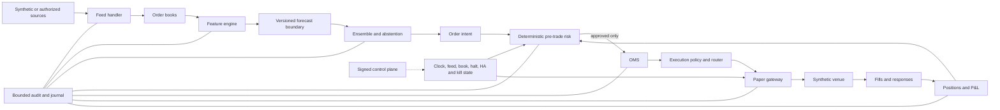
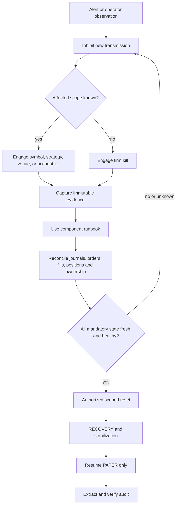

# Aegis-MX operational-readiness package

| Field | Value |
| --- | --- |
| Package status | Complete for repository-owned synthetic/PAPER operation and drills |
| Production decision | **STOP / NO-GO** |
| Live activation | **PROHIBITED; not performed by this package** |
| Effective date | 2026-09-08 |
| Governing contract | [Engineering contract](../architecture/engineering-contract.md) |
| Decision record | [ADR 0044](../adr/0044-final-non-live-operational-readiness-package.md) |

This is the operator entry point. In uncertainty, engage the firm kill, inhibit
new transmission, preserve evidence, and escalate. A checklist completion never
overrides risk, halt, clock, feed/book, fencing, journal, configuration, or
gateway gates.

## System architecture

The authoritative logical design is the [system context](../architecture/system-context.md),
with physical and import ownership in
[component boundaries](../architecture/component-boundaries.md) and the
[dependency graph](../architecture/dependency-graph.mmd). Colocated services use
systemd; Kubernetes is restricted to
[non-hot-path regional services](../architecture/regional-kubernetes-deployment.md).



Arrows represent data flow, not synchronous RPC. Models publish forecasts only.
Risk is mandatory. The diagram intentionally terminates at a synthetic venue;
no licensed production adapter exists.

## Operational control and recovery flow



Kill engagement is biased toward safety. A reset removes one inhibit only and
does not approve an order or restore a mode. `HALTED` and invalid data must pass
through recovery and stabilization; neither transitions directly to `NORMAL`.

## Component ownership

[Component ownership](component-ownership.md) assigns accountable engineering
and operational roles, escalation direction, authoritative state, and change
approval. Role labels are not a substitute for the site-owned named on-call
roster.

## Checklists

1. [Startup and shutdown checklist](startup-shutdown-checklist.md)
2. [Daily PAPER-trading checklist](daily-paper-trading-checklist.md)
3. [Licensed-integration checklist](../compliance/licensed-integration-checklist.md)
4. [Regulatory-review checklist](../compliance/regulatory-review-checklist.md)
5. [Production-activation review checklist](production-activation-checklist.md)

## Incident and recovery runbooks

| Condition | Authoritative procedure | Primary role |
| --- | --- | --- |
| Clock unsafe or unstable | [Clock failure](clock-failure-runbook.md) | Time/platform |
| Feed gap, stale feed, A/B conflict | [Market-data recovery](market-data-recovery-runbook.md) | Market data |
| Official or inferred halt | [Trading halt](trading-halt-runbook.md) | Trading operations and market data |
| Gateway/session failure | [Gateway failure](gateway-failure-runbook.md) | Trading systems |
| Split brain or leader ambiguity | [Edge failover](edge-failover-runbook.md) | SRE and trading systems |
| Model regression or deployment failure | [Model rollback](model-deployment-rollback-runbook.md) | Model platform |
| Manual or automatic kill | [Risk kill switch](risk-kill-switch-runbook.md) | Risk operations |
| Position/fill disagreement | [Portfolio reconciliation](portfolio-reconciliation-runbook.md) | Risk and trading operations |
| Security incident | [Security incident response](../security/incident-response.md) | Security incident commander |
| Site or storage disaster | [Disaster recovery](disaster-recovery-runbook.md) | Incident commander and SRE |

Journal corruption follows the
[copy-only journal recovery runbook](journal-recovery-runbook.md). A partial
colocation failure also uses the
[partial outage runbook](partial-colocation-outage-runbook.md).

## Operator simulation

Run the deterministic PAPER-only drill with:

```bash
AEGIS_PYTHON_ENV=/scratch/djy8hg/env/aegis_mx_contracts \
  make operator-simulation
```

The drill covers symbol, strategy, venue, and firm kills; unauthorized-clear
rejection; authorized recovery; and extraction of nine risk decisions into a
21-record hash chain. It creates no OMS command and has no gateway or activation
dependency. Exact behavior, limitations, and evidence validation are in
[operator simulation testing](../testing/operator-simulation.md).

## Evidence and current decision

The generated evidence must show all of the following simultaneously:

- configured and compiled live capability is false;
- all checked-in edge profiles are `SIMULATION` or `PAPER`, with live
  transmission and automatic activation false;
- the paper gateway has an explicit `AEGIS_LIVE_TRANSMISSION=DISABLED` guard;
- the Go control plane rejects `LIVE` configuration;
- the operator drill reports PAPER, no production activation, and a valid audit
  hash chain; and
- the [production blockers](../reviews/blockers.md) remain visible.

The published evidence is linked from
[operator simulation testing](../testing/operator-simulation.md). Its `passed`
field proves default-off/non-live posture only. It also reports
`production_ready=false` and `activation_status=PROHIBITED`.
