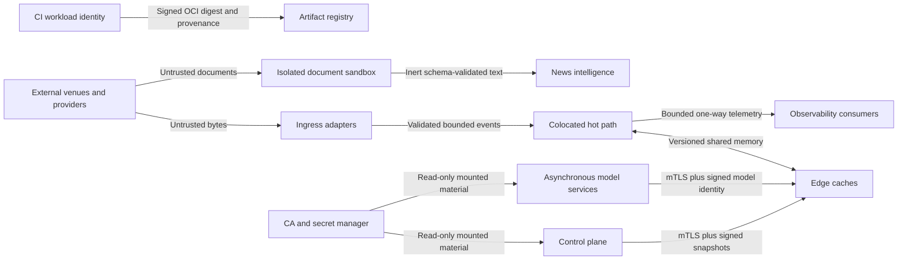

# Aegis-MX Trust Boundaries

## Boundary map

## Boundary rules

| Boundary | Authentication | Authorization | Integrity/freshness | Failure behavior |
| --- | --- | --- | --- | --- |
| Venue/feed to ingress | Licensed adapter session when available; synthetic identity in tests | Venue/channel/session allowlist | Packet checksum, sequence, event timestamp, gap recovery | Mark feed invalid; do not forward as healthy |
| Provider to intelligence | Approved HTTPS host and verified peer evidence or replay hash | Provider/source allowlist | Content SHA-256, receipt time, deduplication, correction lineage | Reject or lower quality; never call order entry |
| Document to parser | None; bytes are hostile | No tools, secrets, network, or policy capability | Size/time/resource bounds and output hash | Terminate sandbox and reject document |
| Service to service | TLS 1.3 mutual authentication and one Aegis-MX URI SAN | Static per-route service permissions plus application RBAC | CA chain, certificate validity, identity allowlist, request deadline and rate | Reject before application work; no plaintext fallback |
| Control plane to edge | Authenticated control service plus Ed25519 signer | Author/approver/activator/rollback/kill roles | Signed immutable hash, revision lineage, activation/expiry/offline age | Cached safe operation only; stale/invalid config blocks new orders |
| Model registry to model cache | Signed manifest and trusted registry state | Approved lifecycle and environment promotion | Artifact hash, feature-schema hash, deployment revision | Reject/disable model; never block risk or OMS |
| Edge shared memory | OS process identity, ownership/mode, isolated host | Single writer/declared reader roles and process epochs | ABI/schema version, checksums, heartbeat, epoch fencing | Treat state stale/invalid and fail closed |
| Hot path to observability/journal | In-process producer ownership | One-way bounded publication | Sequence, stable hashes, correlation/config IDs | Drop with metric or invoke documented safety policy; never block |
| CI to registry | GitHub OIDC workload identity | Tag/manual release workflow only; package write scoped to job | Locked inputs, SBOM/provenance, OCI digest, Cosign verification | Release fails; existing deployments remain unchanged |

## Service identity and certificates

- Identity format is `spiffe://aegis-mx/<environment>/<service>`.
- A certificate must contain exactly one Aegis-MX URI SAN. DNS names, source
  addresses, namespaces, and service-account tokens do not replace identity.
- TLS negotiation and request I/O execute under a hard deadline in an already
  admitted bounded worker; they never block the listener accept loop without a
  bound. Clients compare the verified peer URI with the exact intended service.
- Trust bundles and leaf certificates are separate mounted secret names.
  Secret-manager values never appear in ConfigMaps or environment variables.
- New handshakes reload a coherently hashed certificate/key/trust generation at
  most one second after a mounted update. Failed material does not fall back to
  plaintext or silently extend the previous authority.
- The deployment skeleton names required Secret objects but contains no Secret
  values. The all-zero image digest is a fail-closed placeholder and must be
  replaced by a verified signed digest before application.
- Regional Kubernetes workloads are isolated across five restricted namespaces,
  use dedicated token-free ServiceAccounts and read-only Secrets Store CSI
  mounts, and communicate only through explicit default-deny exceptions. The
  production admission contract rejects mutable/zero images, missing signature
  or configuration evidence, execution authority, and host namespaces. A
  separately operated admission verifier performs the cryptographic OCI
  signature check; repository annotations are evidence bindings, not trust
  roots.

## Least-privilege deployment

Time-series pods run as UID/GID `65532`, drop all Linux capabilities, deny
privilege escalation, use the runtime-default seccomp profile, disable host
namespaces/service links/service-account tokens, mount TLS material read-only,
and have no network egress. Ingress requires production trust-domain and mTLS
client labels, then application-level certificate RBAC. The labels narrow
reachability; certificates remain the authority.

Control-plane CLIs use owner-only signing-key files. Production replaces local
files with HSM/KMS or secret-manager adapters that expose signing operations,
not extractable private bytes. Exchange/broker credentials belong in a
dedicated gateway identity with no model, news, research, or observability
access. They must never be printed or used as metric/trace attributes.

## Network inventory

| Listener/client | Default bind | Protocol | Permitted peers | Trading authority |
| --- | --- | --- | --- | --- |
| Time-series API | No listener without TLS material; container `0.0.0.0:8080` | TLS 1.3 mTLS HTTP | `edge-forecast-cache`, authenticated monitor | None; publishes forecasts only |
| Time-series worker | No listener without TLS material; container `0.0.0.0:8080` | TLS 1.3 mTLS HTTP | time-series API, authenticated monitor | None |
| Context builder | No listener without TLS material; container `0.0.0.0:8080` | TLS 1.3 mTLS HTTP | intelligence service, authenticated monitor | None |
| Official public source client | No ambient implementation; injected client | Server-authenticated HTTPS | Legally approved exact host allowlist | None |
| Config/model CLIs | No network listener | Local process/filesystem | Authorized operator automation | Configuration/model administration only |
| Exchange gateway | Adapter boundary only | Licensed protocol unavailable | Licensed venue/broker endpoint | Disabled by build and runtime safety gates |

See [ADR 0035](../adr/0035-zero-trust-service-boundaries-and-sandboxed-content.md)
and the [incident-response guide](incident-response.md).
